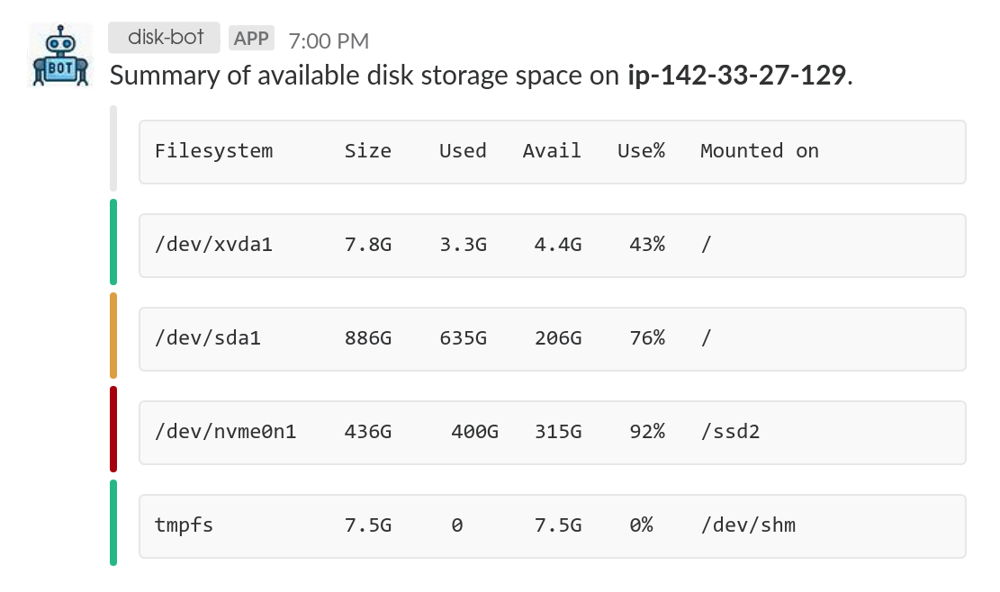

# slack-storage-notifier
Monitor Disk Storage Using A Slack App.

# Usage Instructions
1. Follow [these](https://zir0-93.github.io/2018/slack-disk-storage-notifier/) instructions to create a Slack WebHook.
2. Execute `bash slack_storage_notifier.sh  <webhook_url>`. Use webhook URL generated from step 1. Or, execute 
`bash slack_storage_notifier.sh` and store webhook URL under the `SLACK_WEBHOOK_URL` environment variable.
**Note**: The machine name used in the slack message corresponds the the `$HOSTNAME` environment variable.
